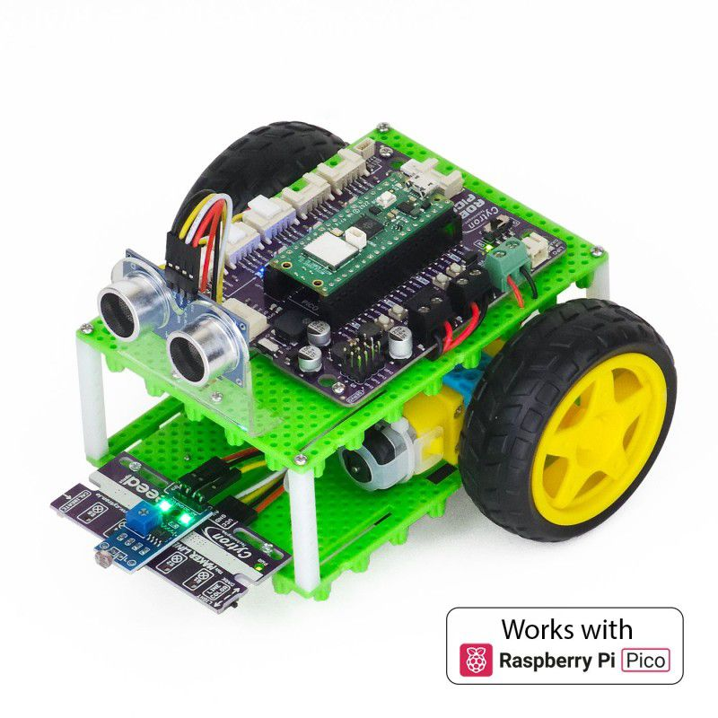
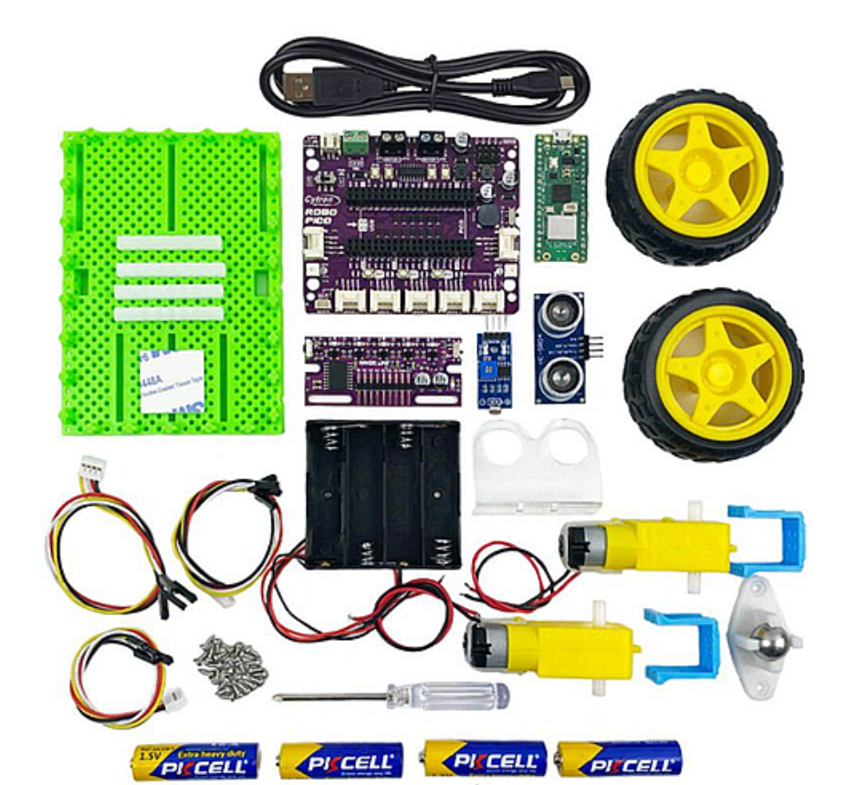
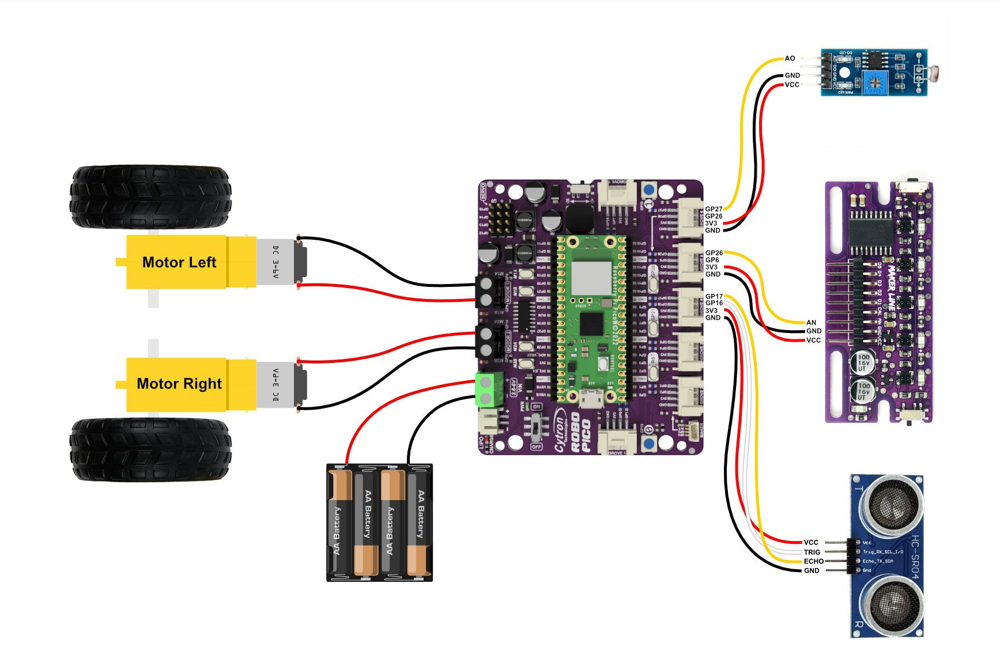

# Guía del Robot

Aquí tienes todos los recursos necesarios para conocer, montar y programar tu robot paso a paso.

## Descripción del BocoBot

El kit oficial que se utilizará en la competición es el **BocoBot**, un kit de robótica basado en Raspberry Pi Pico que cada equipo participante deberá montar por su cuenta, ensamblando el chasis, motores y sensores incluidos en la caja. Tanto el kit como la Raspberry serán entregados con tiempo de antelación para su montaje y pruebas.

A nivel de componentes, el kit incluye exactamente lo que necesitáis para afrontar las distintas pruebas del torneo. Para el desplazamiento, cuenta con **dos motores independientes** con sus respectivas ruedas y una **rueda loca de acero** en la parte inferior, lo que le permite girar sobre sí mismo. Cuenta también con un **sensor siguelíneas** y un **sensor de ultrasonidos** para medir distancias y evitar obstáculos.

Para rematar, la placa base tiene **luces LED de colores**, **botones programables** y un **pequeño altavoz o zumbador**. Todo el sistema funciona con un portapilas estándar para cuatro pilas AA (también incluidas) e incluye el cable USB necesario para conectarlo al ordenador y cargar vuestro código.

---

## Montaje del Robot

### Video tutorial

Sigue paso a paso este vídeo en [:simple-youtube: YouTube](https://www.youtube.com/watch?v=D5FTqS3MgH0){:target="\_blank"} para ensamblar correctamente tu BocoBot:

  <iframe
    src="https://www.youtube.com/embed/D5FTqS3MgH0"
    title="Video tutorial de montaje"
    frameborder="0"
    allow="accelerometer; autoplay; clipboard-write; encrypted-media; gyroscope; picture-in-picture"
    allowfullscreen>
  </iframe>

### Conexión de cables

A continuación puedes ver dónde conectar cada cable:

---

## Programación del Robot

### Instalación de CircuitPython

Antes de poder programar tu BocoBot, necesitas instalar CircuitPython en la Raspberry Pi Pico:

1. **Descarga CircuitPython**:

    - Ve a [circuitpython.org](https://circuitpython.org/board/raspberry_pi_pico/)
    - Descarga la última versión estable para Raspberry Pi Pico (archivo `.uf2`)

2. **Instala CircuitPython en la Pico**:

    - Desconecta la Raspberry Pi Pico de cualquier cable USB
    - Mantén pulsado el botón **BOOTSEL** en la Pico
    - Mientras mantienes el botón pulsado, conecta la Pico al ordenador con el cable USB
    - Suelta el botón BOOTSEL
    - La Pico aparecerá como una unidad de almacenamiento llamada **RPI-RP2**
    - Arrastra y suelta el archivo `.uf2` descargado en la unidad RPI-RP2
    - La Pico se reiniciará automáticamente y aparecerá como **CIRCUITPY**

3. **Verifica la instalación**:

    - Si ves la unidad **CIRCUITPY**, CircuitPython está correctamente instalado
    - Ahora puedes copiar archivos Python directamente a esta unidad

### Cargar tu código

Para programar el robot:

1. Abre tu editor de código favorito (Thonny, Mu Editor, VS Code, etc.)
2. Crea o edita el archivo `code.py` en la unidad **CIRCUITPY**
3. Guarda los cambios - el código se ejecutará automáticamente al guardar
4. Para detener la ejecución, presiona `Ctrl+C` en el terminal serial

!!! tip "Consejo"
    El archivo principal debe llamarse **`code.py`** para que CircuitPython lo ejecute automáticamente al iniciar.

### Ejemplos de código

En el repositorio oficial de [:simple-github: GitHub](https://github.com/CytronTechnologies/Robo-Pico-Kit-CircuitPython){:target="\_blank"} encontrarás ejemplos para:

- Control básico de motores
- Lectura del sensor de ultrasonidos
- Uso del sensor siguelíneas
- ¡Y más!

### Recursos adicionales

- [Documentación oficial de CircuitPython](https://docs.circuitpython.org/)
- [Guía de CircuitPython para principiantes](https://learn.adafruit.com/welcome-to-circuitpython)
