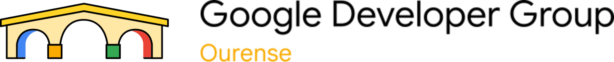
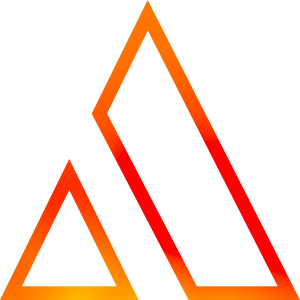

---
hide:
  - toc
  - navigation
meta:
  - property: "og:title"
    content: "Torneo de Robótica Bocobot"
  - property: "og:description"
    content: "¡Monta, programa y compite con tu propio robot! ESEI Ourense, 27 de abril."
  - property: "og:image"
    content: "./assets/banner.png"
  - property: "og:type"
    content: "website"
---

# Torneo de Robótica Bocobot 🤖

### ¿Te atreves a montar, programar y competir con tu propio robot?

Desde la asignatura de Robótica de 4º de IA en la ESEI organizamos el **primer Torneo Bocobot**: una competición amistosa donde cada equipo recibe un kit de robótica, lo monta, lo programa y compite en distintas pruebas. **No necesitas experiencia previa**; te proporcionamos todo lo necesario, incluyendo guías y apoyo.

  
📅 <strong>27 de abril</strong> por la tarde

  
📍 Hall de la <a href="https://esei.uvigo.es/">ESEI</a> (Ourense)

  
👥 Equipos de 1 a 4 personas

  
🏆 Trofeos impresos en 3D + premios de patrocinadores

---

## Las Pruebas

Competiréis en **5 pruebas** diferentes. Aquí va un aperitivo:

  
🏎️

  
Siguelíneas

  
Tu robot sigue una ruta marcada en el suelo con cinta adhesiva, esquivando obstáculos por el camino

  
🤼

  
Sumo

  
Enfrentamiento 1 contra 1: empuja al rival fuera del ring circular sin dañarlo

  
🧹

  
Limpieza

  
Saca todos los objetos del recinto empujándolos con tu robot lo más rápido posible

  
🏁

  
Aceleración

  
Sprint en línea recta a toda velocidad y frena con precisión en la zona objetivo

  
🎨

  
Desfile

  
Personaliza y decora tu robot, programa luces y sonidos, y demuestra tu creatividad

  <a href="./normas/" class="md-button md-button--primary">Ver reglas completas</a>

---

## Tu Robot: el BocoBot

  

    
Cada equipo recibirá un kit <strong>BocoBot</strong> con todo lo necesario: chasis, motores, sensores, LEDs, buzzer y Raspberry Pi Pico. Solo tenéis que montarlo, programarlo en <strong>CircuitPython</strong> (Python simplificado) y ¡a competir!

    <a href="./guia-robot/" class="md-button">Guía completa de montaje y programación →</a>
  

  

    
  

---

## Preguntas frecuentes

??? question "¿Necesito saber programar?"
    No es obligatorio tener experiencia previa, aunque por supuesto ayuda. Os proporcionaremos guías y ejemplos de código para que hagáis a vuestro robot funcionar cuanto antes. Hay muchos ejemplos de código que os darán una base muy sólida para completar las pruebas.

??? question "¿Tengo que comprar algo?"
    **No.** Os prestamos el kit completo (robot + Raspberry Pi Pico + pilas + cable USB). Solo necesitáis un ordenador para programarlo, o pilas nuevas si se os acaban.

??? question "¿En qué lenguaje se programa?"
    En **CircuitPython**, que es básicamente Python adaptado para hardware. Si sabes Python, ya sabes casi todo. Si no, es un buen momento para aprender. También podéis usar cualquier otro lenguaje que funcione en la Raspberry Pico, como Arduino, eso depende de vosotros!

??? question "¿Puedo participar solo/a?"
    Sí, los equipos pueden ser de **1 a 4 personas**. No obstante, recomendamos formar equipos para repartir tareas.

---

## Premios 🏆

¡Habrá premios para los mejores equipos!

- 🥇 **1º, 2º y 3º puesto**: Trofeos impresos en 3D
- 🎁 **Premios de patrocinadores**: Se anunciarán el día del torneo
- ⭐ **Todos los participantes** recibirán un detalle de participación

---

<a href="./normas/" class="card">
  
📜 Normas del Torneo

  
Lee las reglas antes de participar

</a>

<a href="./guia-robot/" class="card">
  
🔧 Guía del Robot

  
Montaje, programación y configuración completa

</a>

<a href="https://docs.google.com/forms/d/e/1FAIpQLScpvvbQE-pS9H050xOW6uJyefBrO_nOn3Itc3BrAmD3Ni02DA/viewform" class="card" target="_blank">
  
✏️ Inscripción

  
Registra a tu equipo (máx. 8 equipos)

</a>

???+ warning "¡Plazas limitadas!"
    Hay un límite de **8 equipos** para participar, así que asegúrate de inscribirte lo antes posible.

---

## Patrocinadores

Agradecemos el apoyo de las siguientes empresas:

---

## Organizadores

<a href="https://github.com/Sergiooo0" class="organizer-card" target="_blank">
  
  
Sergio

  
GitHub

</a>

<a href="https://github.com/usbt0p" class="organizer-card" target="_blank">
  
  
Lucas

  
GitHub

</a>

  
  
Carlos

  
Próximamente

